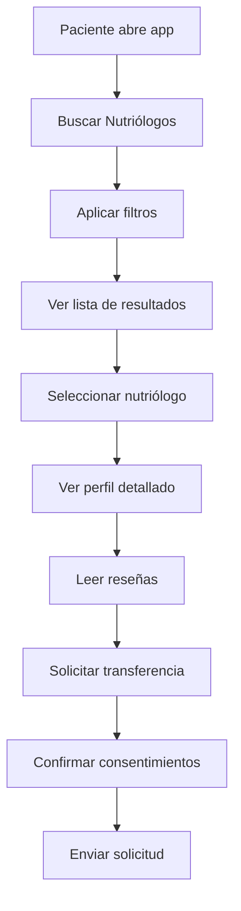
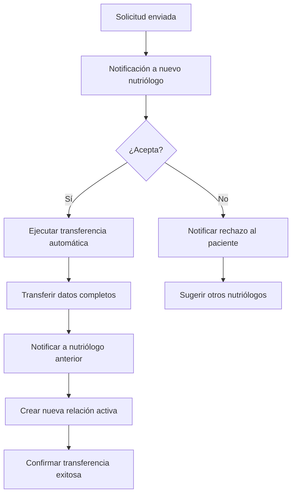
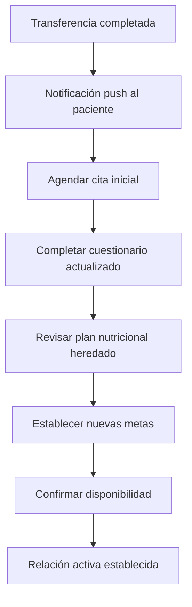

# Planificación: Aplicación Móvil del Paciente
## Transferencia Automática de Nutriólogos

### Contexto Actual y Futuro

#### Estado Actual (2025)
- **Frontend Web**: Solo para nutriólogos y administradores
- **Pacientes**: Sin acceso directo al sistema
- **Transferencias**: Manuales a través de admin/nutriólogo
- **Prototipo**: Script `test-transferencia-completa.ts` validado

#### Visión Futura: App Móvil del Paciente
- **Autonomía Total**: Pacientes gestionan sus propias relaciones
- **Búsqueda Inteligente**: Filtros por especialidad, ubicación, calificaciones
- **Transferencia Automática**: Proceso seamless sin pérdida de datos
- **Notificaciones**: Alertas push para ambas partes

---

## Arquitectura de Endpoints API

### 1. Gestión de Relaciones con Nutriólogos

#### Listar Nutriólogos Disponibles
```typescript
GET /api/mobile/nutritionists/available
Query Parameters:
- specialty?: string
- location?: string
- rating_min?: number
- price_range?: string
- availability?: boolean

Response:
{
  "nutritionists": [
    {
      "id": "uuid",
      "name": "Dr. Juan Pérez",
      "specialty": "Nutrición Deportiva",
      "rating": 4.8,
      "total_reviews": 156,
      "location": "Ciudad de México",
      "price_range": "$$",
      "availability": true,
      "profile_image": "url",
      "certifications": ["string"],
      "languages": ["español", "inglés"]
    }
  ],
  "total": 25,
  "page": 1,
  "per_page": 10
}
```

#### Obtener Detalles de Nutriólogo
```typescript
GET /api/mobile/nutritionists/{nutritionist_id}/profile

Response:
{
  "id": "uuid",
  "personal_info": {
    "name": "Dr. Juan Pérez",
    "specialty": "Nutrición Deportiva",
    "experience_years": 8,
    "education": ["string"],
    "certifications": ["string"]
  },
  "ratings": {
    "average": 4.8,
    "total_reviews": 156,
    "distribution": {
      "5": 120,
      "4": 28,
      "3": 6,
      "2": 1,
      "1": 1
    }
  },
  "availability": {
    "schedule": "object",
    "next_available": "2025-07-15T10:00:00Z"
  },
  "pricing": {
    "consultation_fee": 800,
    "currency": "MXN",
    "payment_methods": ["card", "transfer"]
  },
  "reviews": [
    {
      "patient_name": "María L.",
      "rating": 5,
      "comment": "Excelente atención y seguimiento",
      "date": "2025-06-15"
    }
  ]
}
```

### 2. Transferencia de Nutriólogos

#### Solicitar Transferencia
```typescript
POST /api/mobile/patients/transfer-nutritionist

Request Body:
{
  "current_nutritionist_id": "uuid",
  "new_nutritionist_id": "uuid",
  "transfer_reason": "Busco especialista en nutrición deportiva",
  "transfer_type": "immediate" | "scheduled",
  "scheduled_date": "2025-07-15T00:00:00Z", // opcional
  "patient_consent": true,
  "data_transfer_consent": true
}

Response:
{
  "transfer_id": "uuid",
  "status": "pending_approval",
  "estimated_completion": "2025-07-03T12:00:00Z",
  "steps": [
    {
      "step": "new_nutritionist_approval",
      "status": "pending",
      "estimated_time": "24-48 hours"
    },
    {
      "step": "data_transfer",
      "status": "waiting",
      "estimated_time": "30 seconds"
    },
    {
      "step": "notification_previous",
      "status": "waiting",
      "estimated_time": "immediate"
    }
  ]
}
```

#### Confirmar Transferencia (Endpoint para Nutriólogo)
```typescript
POST /api/mobile/nutritionists/transfer-requests/{transfer_id}/respond

Request Body:
{
  "decision": "accept" | "reject",
  "message": "Acepto recibir al paciente. Programaremos cita inicial.",
  "proposed_appointment": "2025-07-10T10:00:00Z" // opcional
}
```

#### Ejecutar Transferencia Automática
```typescript
POST /api/mobile/patients/execute-transfer/{transfer_id}

Response:
{
  "transfer_id": "uuid",
  "status": "completed",
  "summary": {
    "transferred_data": {
      "clinical_records": 3,
      "diet_plans": 12,
      "progress_records": 45,
      "appointments_history": 8
    },
    "previous_nutritionist": {
      "id": "uuid",
      "name": "Dr. Sistema Nutricional",
      "notified": true
    },
    "new_nutritionist": {
      "id": "uuid",
      "name": "Dr. Juan Pérez",
      "notified": true
    }
  },
  "next_steps": [
    "Agendar cita inicial con nuevo nutriólogo",
    "Revisar plan nutricional actualizado",
    "Completar cuestionario de preferencias"
  ]
}
```

### 3. Gestión de Relaciones Activas

#### Obtener Nutriólogo Actual
```typescript
GET /api/mobile/patients/current-nutritionist

Response:
{
  "nutritionist": {
    "id": "uuid",
    "name": "Dr. Juan Pérez",
    "specialty": "Nutrición Deportiva",
    "relationship_since": "2025-01-15",
    "total_appointments": 12,
    "last_appointment": "2025-06-28",
    "next_appointment": "2025-07-05T10:00:00Z",
    "contact_info": {
      "phone": "+52 55 1234 5678",
      "email": "dr.juan.perez@demo.com"
    }
  },
  "relationship_status": "active",
  "satisfaction_rating": 4.8,
  "can_transfer": true
}
```

#### Finalizar Relación
```typescript
POST /api/mobile/patients/end-relationship

Request Body:
{
  "nutritionist_id": "uuid",
  "reason": "Busco especialista en otra área",
  "rating": 5,
  "review": "Excelente atención durante todo el proceso",
  "data_retention": "transfer_to_new" | "keep_with_current" | "delete_after_30_days"
}
```

---

## Flujos de Usuario en App Móvil

### Flujo 1: Búsqueda de Nuevo Nutriólogo



### Flujo 2: Proceso de Transferencia



### Flujo 3: Gestión Post-Transferencia



---

## Consideraciones de Seguridad

### Autenticación y Autorización
- **JWT Tokens**: Para sesiones móviles
- **Biometría**: Touch ID / Face ID para acceso rápido
- **2FA**: Verificación en dos pasos para cambios críticos
- **Session Management**: Tokens con expiración automática

### Protección de Datos
- **Encriptación**: Datos sensibles encriptados en tránsito y reposo
- **Consentimiento**: Confirmación explícita para transferencias
- **Auditoría**: Log completo de todas las transferencias
- **Retención**: Políticas claras de retención de datos

### Validaciones de Negocio
- **Límite de Transferencias**: Máximo 2 por mes
- **Período de Espera**: 7 días entre transferencias
- **Validación de Disponibilidad**: Verificar capacidad del nutriólogo
- **Restricciones por Tratamiento**: Evitar transferencias durante tratamientos críticos

---

## Notificaciones Push

### Para Pacientes
- **Transferencia Aprobada**: "¡Tu nuevo nutriólogo ha aceptado! Agenda tu primera cita"
- **Transferencia Rechazada**: "Te sugerimos estos otros nutriólogos disponibles"
- **Transferencia Completada**: "Todos tus datos han sido transferidos exitosamente"
- **Recordatorio de Cita**: "Tienes una cita con Dr. Juan Pérez mañana a las 10:00 AM"

### Para Nutriólogos
- **Nueva Solicitud**: "Tienes una solicitud de transferencia de María García"
- **Transferencia Confirmada**: "Los datos de tu nuevo paciente están listos"
- **Paciente Transferido**: "María García se ha transferido a otro nutriólogo"

---

## Métricas y Analytics

### KPIs del Paciente
- **Tiempo de Transferencia**: Meta < 48 horas
- **Satisfacción Post-Transferencia**: Meta > 4.5/5
- **Retención**: % de pacientes que se quedan con nuevo nutriólogo
- **Reactivación**: % de pacientes que regresan con nutriólogo anterior

### KPIs del Sistema
- **Transferencias Exitosas**: Meta > 95%
- **Tiempo de Respuesta API**: Meta < 200ms
- **Integridad de Datos**: 100% de datos transferidos
- **Disponibilidad**: 99.9% uptime

---

## Roadmap de Implementación

### Fase 1: MVP (Q3 2025)
- ✅ Backend: Script de transferencia validado
- 🔄 API: Endpoints básicos de transferencia
- 🔄 App: Pantallas básicas de búsqueda y transferencia
- 🔄 Testing: Casos de uso principales

### Fase 2: Mejoras UX (Q4 2025)
- 🔄 Filtros avanzados de búsqueda
- 🔄 Sistema de calificaciones y reseñas
- 🔄 Notificaciones push inteligentes
- 🔄 Onboarding mejorado

### Fase 3: Funcionalidades Avanzadas (Q1 2026)
- 🔄 Transferencias programadas
- 🔄 Recomendaciones basadas en IA
- 🔄 Chat en tiempo real con nutriólogos
- 🔄 Integración con wearables

---

## Conclusión

El prototipo de transferencia desarrollado (`test-transferencia-completa.ts`) es la base sólida para implementar la funcionalidad completa en la aplicación móvil del paciente. Los endpoints planificados garantizan una experiencia fluida y segura, manteniendo la integridad de los datos durante todo el proceso.

La arquitectura propuesta permite escalabilidad futura y se alinea con las mejores prácticas de seguridad y UX para aplicaciones móviles de salud. 